# 🩺 Automated Skin Lesion Tracking & Segmentation
### Powered by U-Net & TensorFlow


## 📌 Overview

**UNet_Segmentation** is a specialized medical imaging toolkit designed to automate the early detection and monitoring of skin lesions (such as moles and potential melanomas).

By leveraging a custom **U-Net Convolutional Neural Network (CNN)**, this project performs pixel-perfect segmentation of skin lesions from standard photographs. Beyond simple detection, it includes a **Temporal Analysis Module** that tracks changes in lesion properties (size, color, shape) over time, providing automated alerts for suspicious evolution—a critical factor in early cancer diagnosis.

---

## 🚀 Key Features

*   **🧠 Deep Learning Segmentation**: Implements a full U-Net architecture with encoder-decoder paths and skip connections to precisely delineate lesion boundaries.
*   **📉 Temporal Tracking System**: A dedicated tracking module (`build_tracking_df`) that records lesion history across multiple patient visits.
*   **⚠️ Automated Alerts**: Smart logic that triggers specific warnings if a lesion's surface area changes by more than **15%** (configurable) or exhibits significant color shifts.
*   **🛠️ Robust Preprocessing**: Utilizes `Albumentations` for professional-grade data augmentation (flips, contrast adjustments) to ensure model generalization across different skin tones and lighting conditions.
*   **📊 Clinical Visualization**: Generates growth trend plots (Area vs. Time) and side-by-side overlays of Ground Truth vs. Predicted Masks.

---

## 🏥 Clinical Workflow

```mermaid
graph LR
    Input[Raw Skin Image] -->|Preprocessing| Aug[Augmentation]
    Aug -->|U-Net Model| Mask[Binary Segmentation Mask]
    Mask -->|Extraction| Feats[Feature Extraction]
    Feats -->|Area & Color| Database[Patient History]
    Database -->|Compare w/ Baseline| Logic{Significant Change?}
    Logic -->|Yes| Alert[🚨 TRIGGER ALERT]
    Logic -->|No| Safe[✅ Routine Monitor]
```



---

## 🛠️ Technical Architecture

### The U-Net Model
The core of this repository is a custom Keras implementation of U-Net:
*   **Encoder**: 4 blocks of Conv2D + MaxPooling (Contracting path)
*   **Bottleneck**: 512 filters capturing deep semantic features
*   **Decoder**: 4 blocks of UpSampling + Concatenation (Expansive path)
*   **Output**: Sigmoid activation for binary classification (Lesion vs. Skin)

### Feature Extraction
Once segmented, the system calculates:
1.  **Lesion Area** (in pixels)
2.  **Mean RGB Color** (to detect darkening)
3.  **Growth Rate** (% change from baseline)

---

## 📦 Installation & Prerequisites

### Dependencies
Ensure you have the following libraries installed:

```bash
pip install tensorflow opencv-python albumentations pandas matplotlib scikit-learn scikit-image tqdm
```

### Dataset
This project is optimized for the **HAM10000** dataset ("Human Against Machine with 10000 training images").
*   Download the dataset from [Kaggle](https://www.kaggle.com/kmader/skin-cancer-mnist-ham10000).
*   Extract it to a local folder (e.g., `./data/raw/HAM10000/`).

---

## 💻 Usage Guide

### 1. Training the Model
The script `skin_lesion_tracking_using_UNet_segmentation.py` handles the full pipeline. Ensure your data paths are correctly set in the `Configuration` section of the script.

```python
# In the script, update:
DATA_DIR = '/path/to/your/HAM10000/'
```

Run the training loop:
```bash
python skin_lesion_tracking_using_UNet_segmentation.py
```
*   The model automatically saves the best checkpoints (`unet_best.h5`).
*   Early stopping is enabled to prevent overfitting.

### 2. Patient Monitoring & Tracking
To simulate patient tracking, use the built-in `build_tracking_df` function with a list of image records:

```python
# Example Usage in Python
records = [
    {'date': '2023-01-01', 'image_rgb': img1},
    {'date': '2023-06-01', 'image_rgb': img2}
]

df = build_tracking_df(patient_id="PATIENT_001", records=records)
print(alert_on_change(df)) 
# Output: "Alert! Lesion changed by 20.5% since baseline..."
```

---

## 📊 Results Summary

The model provides distinct outputs for clinical review:

| Visualization | Description |
|:---|:---|
| **Segmentation Mask** | A binarized overlay showing exactly where the lesion is located. |
| **Growth Plot** | A dual-axis chart showing Area (pixels) and % Change over time. |
| **Color Stats** | Quantitative analysis of the lesion's mean color values (R,G,B). |

---

## 🤝 Roadmap

*   [ ] **Real-world Scaling**: Calibrate pixel-to-mm conversion using a reference marker (e.g., a coin/ruler in the photo).
*   [ ] **3D Analysis**: Integrate depth sensing for volumetric analysis.
*   [ ] **Mobile App**: Port the TFLite model to a mobile application for at-home screening.

---

## 📄 License

Distributed under the MIT License.
